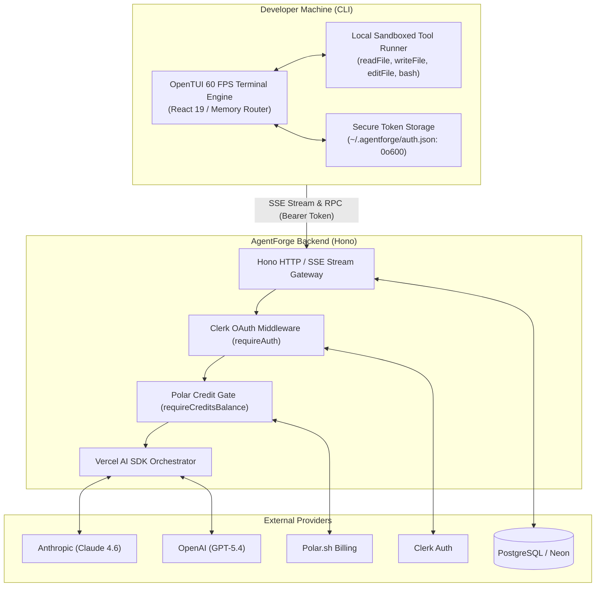

<div align="center">

# ⚡ AgentForge

### *Forge Code at the Speed of Thought.*

An autonomous, terminal-first AI coding assistant powered by **OpenTUI**, **React 19**, **Hono**, and the **Vercel AI SDK**. Built for engineers who live in the command line.

---

[](https://bun.sh/)
[](https://www.typescriptlang.org/)
[](https://react.dev/)
[](https://hono.dev/)
[](https://www.prisma.io/)
[](https://www.postgresql.org/)
[](LICENSE)

[**Quick Start**](#-quick-start) • [**Features**](#-key-features) • [**Architecture**](#-architecture) • [**CLI Cheatsheet**](#-interactive-tui-cheatsheet) • [**Documentation**](#-documentation-index)

</div>

---

## 🌟 Why AgentForge?

AgentForge bridges the gap between frontier AI reasoning and real-world software engineering. Unlike disconnected chat windows or heavy desktop IDE wrappers, AgentForge lives directly inside your shell, runs at **60 FPS**, and executes tools **locally on your machine** with strict path-containment security.

With native **Dual-Mode Execution**, you can safely investigate codebases in **PLAN** mode without altering a single byte, then switch to **BUILD** mode with a single keystroke to let the agent write code, create files, and run tests.

---

## 🚀 Key Features

- ⚡ **60 FPS Terminal User Interface**: Powered by OpenTUI (`@opentui/core` & `@opentui/react`) and React 19. Delivers instant keyboard responses, animated spinners, thinking blocks, and smooth streaming.
- 🛡️ **Dual-Mode Operational Engine**:
  - **PLAN Mode**: Safe, read-only exploration and architecture planning (`readFile`, `listDirectory`, `glob`, `grep`).
  - **BUILD Mode**: Autonomous implementation with atomic modifications (`writeFile`, `editFile`, `bash`).
  - Toggle between modes seamlessly using the <kbd>Tab</kbd> key.
- 🔒 **Sandboxed Local Execution**: Every tool execution is strictly sandboxed to the project directory (`resolveInsideCwd`), eliminating risk of escaping repository boundaries.
- 🧠 **Frontier Multi-Model Intelligence**: Out-of-the-box support for Anthropic Claude 4.6 (with extended thinking budgets up to 10k tokens) and OpenAI GPT-5.4 models.
- 📂 **Native `@` Mentions**: Type `@` anywhere in the prompt for instant, fuzzy-searched file and directory autocomplete.
- 🔑 **PKCE Browser OAuth**: Sign in effortlessly with Clerk via automated CLI callback listeners on localhost.
- 💳 **Usage-Based Credit Accounting**: Transparent billing powered by **Polar.sh**, pegged at **$0.01 per credit** with balance gating middleware.
- 🎨 **Curated Theming**: Built-in themes including **Nightfox**, **Catppuccin Mocha**, **Dracula**, **Monokai Pro**, **Tokyo Night**, and **Nord**.

---

## 🏛 Architecture

AgentForge is architected as a TypeScript monorepo where **reasoning, auth, and billing** are managed centrally by the server, while **tool execution and file manipulation** remain strictly local on your machine.



For full details, read the [Architecture Deep Dive](docs/ARCHITECTURE.md).

---

## ⚡ Quick Start

### Prerequisites
- **[Bun](https://bun.sh/)** $\ge 1.2.0$
- **PostgreSQL** (Local or [Neon](https://neon.tech/))
- **Git**

### 1. Clone & Install
```bash
git clone https://github.com/Abhijit-Deshmane/AgentForge.git
cd AgentForge
bun install
```

### 2. Configure Environment
Copy the sanitized environment template and populate your API credentials:
```bash
cp .env.example .env
```
*(See [.env.example](.env.example) for documentation on every variable)*.

### 3. Generate Database Client
```bash
bun run --cwd packages/database db:generate
```

### 4. Start Local Development

Open two terminal windows:

```bash
# Terminal 1: Backend Server (Port 3000)
bun dev:server

# Terminal 2: Terminal User Interface
bun dev:cli
```

### 5. Install `AgentForge` Globally (Optional)
To use `AgentForge` from any project directory:
```bash
bun run link:cli
```
Now simply run `AgentForge` in any terminal!

---

## ⌨️ Interactive TUI Cheatsheet

### Keyboard Controls

| Shortcut | Action |
| :--- | :--- |
| <kbd>Enter</kbd> | Submit message or execute selected command / mention. |
| <kbd>Shift</kbd> + <kbd>Enter</kbd> | Insert a newline into the prompt textarea. |
| <kbd>Tab</kbd> | **Toggle Mode** between `BUILD` and `PLAN`. |
| <kbd>Esc</kbd> | **Interrupt** active generation or dismiss active popups/dialogs. |
| <kbd>Ctrl</kbd> + <kbd>C</kbd> | Clear input bar text. |
| <kbd>@</kbd> | Open interactive file / directory autocomplete picker. |
| <kbd>/</kbd> | Open the slash command palette. |
| <kbd>↑</kbd> / <kbd>↓</kbd> | Navigate autocomplete candidates. |

### Slash Commands (`/`)

| Command | Description |
| :--- | :--- |
| `/new` | Start a fresh conversation session. |
| `/agents` | Open agent mode selector dialog (Build vs Plan). |
| `/models` | Select AI model (Claude Opus/Sonnet/Haiku, GPT-5.4). |
| `/sessions` | Browse and restore previous sessions from PostgreSQL. |
| `/theme` | Open theme picker (Nightfox, Catppuccin, Dracula, etc.). |
| `/login` | Authenticate in browser via PKCE OAuth. |
| `/logout` | Sign out and clear stored local tokens. |
| `/upgrade` | Open checkout to purchase usage credits. |
| `/usage` | Launch Polar billing portal to view invoices and consumption. |
| `/exit` | Quit the application. |

For a complete manual, see the [CLI Reference](docs/CLI_REFERENCE.md).

---

## 📦 Monorepo Anatomy

```
AgentForge/
├── packages/
│   ├── cli/             # Terminal User Interface & Local Sandboxed Tool Runner
│   │   ├── bin/         # Executable wrapper (AgentForge)
│   │   ├── src/screens/ # Home, NewSession, Session views
│   │   ├── src/lib/     # Sandboxed tools, PKCE OAuth, API client
│   │   └── src/theme.ts # 6+ curated terminal color themes
│   │
│   ├── server/          # Hono Backend API & AI SDK Streaming Orchestrator
│   │   ├── src/routes/  # /chat, /sessions, /auth, /billing
│   │   ├── src/lib/     # Polar integration, credits calculation, model registry
│   │   └── src/middleware/ # Clerk auth & Polar credit balance verification
│   │
│   ├── database/        # Prisma Schema & PostgreSQL Client
│   │   ├── prisma/      # Schema definition & SQL migrations
│   │   └── src/client.ts# PrismaPg driver adapter configuration
│   │
│   └── shared/          # Universal Zero-Dependency Contracts
│       ├── src/models.ts# Model catalog, token pricing & default configurations
│       └── src/schemas.ts# Zod tool contracts & dual-mode definitions
│
├── docs/                # Comprehensive Technical Library
├── .env.example         # Sanitized configuration template
└── package.json         # Workspace root definitions
```

---

## 🧠 Supported Models & Credit Pricing

AgentForge standardizes on an internal credit peg where **1 Credit = $0.01 USD (1 Cent)**:

| Model ID | Provider | Input / 1M Tokens | Output / 1M Tokens | Features |
| :--- | :--- | :--- | :--- | :--- |
| **`claude-opus-4-6`** *(Default)* | Anthropic | $5.00 | $25.00 | Extended thinking (10k tokens) |
| **`claude-sonnet-4-6`** | Anthropic | $3.00 | $15.00 | Extended thinking (10k tokens) |
| **`claude-haiku-4-5`** | Anthropic | $1.00 | $5.00 | High-speed lightweight agent |
| **`gpt-5.4`** | OpenAI | $2.50 | $15.00 | Detailed reasoning summaries |
| **`gpt-5.4-mini`** | OpenAI | $0.75 | $4.50 | Cost-effective generalist |
| **`gpt-5.4-nano`** | OpenAI | $0.20 | $1.25 | Ultra low-latency assistant |

For the complete billing formula and Polar integration details, read [Billing & Credits](docs/BILLING_AND_CREDITS.md).

---

## 🔒 Security & Sandboxing Model

AgentForge runs code on your machine, so security is a first-class priority:

1. **Path Traversal Guard (`resolveInsideCwd`)**: Tools resolve relative paths and verify that targets stay strictly inside `process.cwd()`. Any attempt to escape via `../../` or absolute paths is blocked.
2. **Deterministic File Edits**: `editFile` requires that the target replacement string exists **uniquely** once in the file. Ambiguous matches fail immediately to prevent unintended file corruption.
3. **Command Execution Safeguards**: Shell commands run inside `TERM=dumb` with a strict **30-second kill timeout** and capped stdout/stderr buffers.
4. **Owner-Only Credential Permissions**: Authentication tokens in `~/.agentforge/auth.json` are written with POSIX `0o600` permissions inside a `0o700` directory.

---

## 📚 Documentation Index

Explore the full technical documentation suite in [`docs/`](docs/):

- 🏛 **[System Architecture](docs/ARCHITECTURE.md)**: Deep dive into the streaming protocol, monorepo dependency graph, and security model.
- 🖥 **[CLI Reference Manual](docs/CLI_REFERENCE.md)**: Exhaustive manual for keybindings, slash commands, file mentions, and themes.
- 📡 **[Backend API Reference](docs/API_REFERENCE.md)**: Endpoints, schemas, authentication, and SSE streaming specifications.
- 💳 **[Billing & Credits](docs/BILLING_AND_CREDITS.md)**: Token-to-credit conversion formulas, Polar meter ingestion, and balance gating.
- 🛠 **[Developer & Contributor Guide](docs/DEVELOPMENT_GUIDE.md)**: Local onboarding, database migrations, adding new tools, and extending models.

---

## 🤝 Contributing

Contributions are welcome! Please check out the [Developer Guide](docs/DEVELOPMENT_GUIDE.md) to get started with local development, database setup, and code conventions.

1. Fork the project.
2. Create your feature branch (`git checkout -b feature/amazing-feature`).
3. Commit your changes (`git commit -m 'feat: add amazing feature'`).
4. Push to the branch (`git push origin feature/amazing-feature`).
5. Open a Pull Request.

---

## 📄 License

Distributed under the **MIT License**. See `LICENSE` for more information.

<div align="center">
  <sub>Built with ❤️ by the AgentForge team.</sub>
</div>