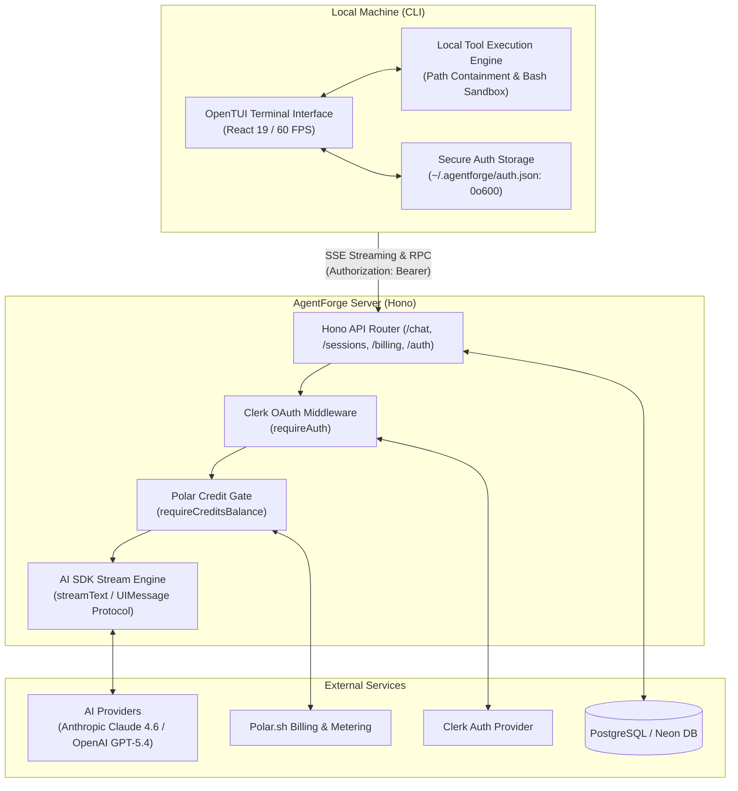
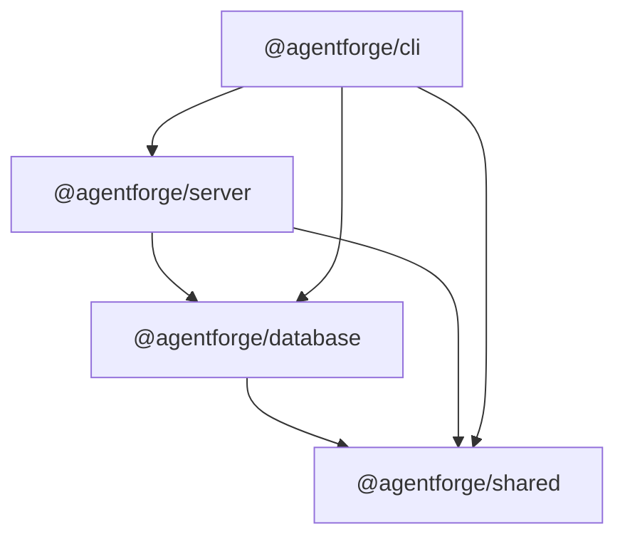
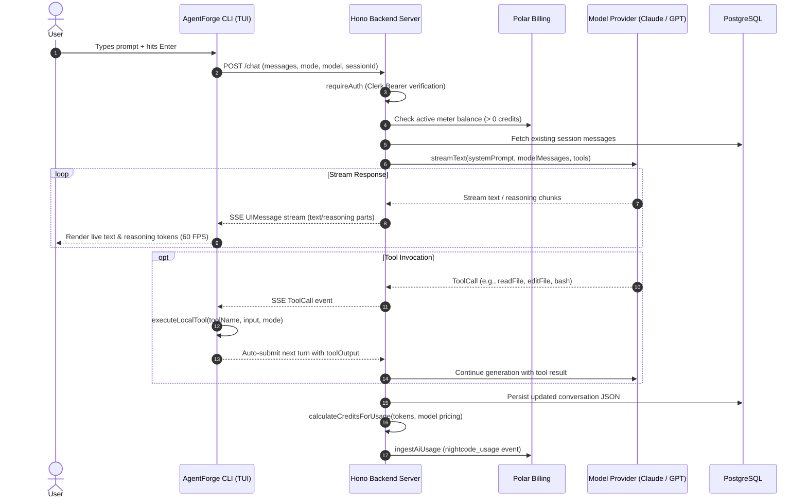
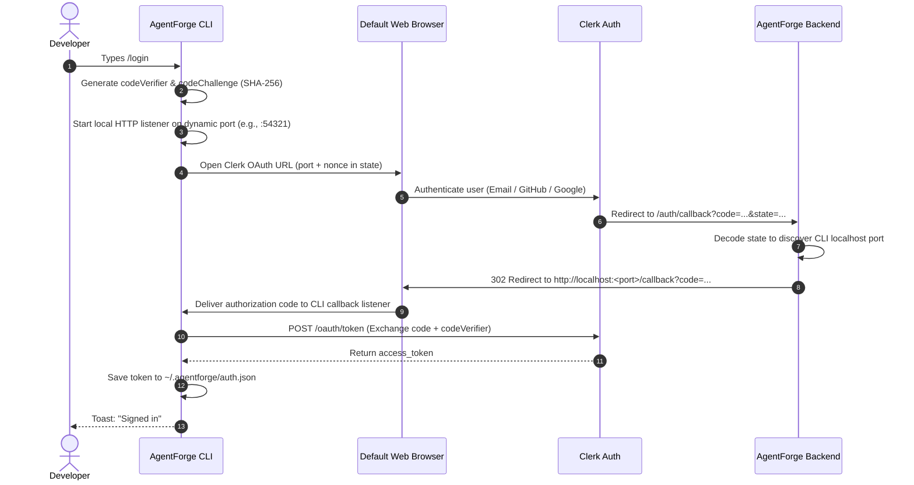

# AgentForge Architecture Guide

This document provides an in-depth architectural breakdown of **AgentForge** — a terminal-first autonomous AI coding assistant. It covers system topologies, data flows, security boundaries, authentication mechanisms, and runtime execution loops.

---

## 1. System Overview

AgentForge is built as a modular TypeScript monorepo managed with **Bun Workspaces**. The platform decouples **agentic reasoning and billing** (hosted on a server) from **local file manipulation and command execution** (hosted inside the user's terminal environment).



---

## 2. Monorepo Package Layout

```
AgentForge/
├── packages/
│   ├── cli/        # Terminal User Interface & Local Sandboxed Execution Engine
│   ├── server/     # Hono HTTP API, Vercel AI SDK streaming, auth & metering
│   ├── database/   # Prisma ORM client with PostgreSQL driver adapter
│   └── shared/     # Universal type contracts, model definitions, schemas & tools
├── package.json    # Monorepo workspaces definition and root lifecycle scripts
└── tsconfig.base.json # Shared TypeScript compiler settings
```

### Dependency Graph



### Package Responsibilities

| Package | Purpose | Key Technologies |
| :--- | :--- | :--- |
| **`@agentforge/cli`** | Interactive terminal user interface, client-side tool execution, local OAuth server, keyboard routing. | OpenTUI (`@opentui/core`, `@opentui/react`), React 19, React Router 7, Bun. |
| **`@agentforge/server`** | API gateway, token metering, streaming LLM orchestrator, session persistence. | Hono, Vercel AI SDK (`ai`), Clerk Backend, Polar SDK. |
| **`@agentforge/database`** | Database schema, migrations, and type-safe query client. | Prisma 7, `@prisma/adapter-pg`, PostgreSQL (Neon). |
| **`@agentforge/shared`** | Zero-dependency contracts: model definitions, token pricing, Zod tool schemas, dual modes. | TypeScript, Zod. |

---

## 3. Client-Server Streaming & Tool Execution Loop

AgentForge uses a **reverse tool execution pattern**:
1. The backend orchestrates the LLM call using the **Vercel AI SDK**.
2. When the model requests a tool call (e.g. `readFile`, `bash`), the tool call is serialized as a streaming UI message part and sent to the CLI over Server-Sent Events (SSE).
3. The CLI executes the tool **locally** against the developer's current working directory.
4. The CLI returns the tool output back into the streaming session, automatically waking up the model to continue generation until the turn finishes.



---

## 4. Dual-Mode Operational Engine

AgentForge enforces strict operational boundaries via two distinct modes:

```
┌─────────────────────────────────────────────────────────────┐
│                       AGENTFORGE MODES                      │
├──────────────────────────────┬──────────────────────────────┤
│         BUILD MODE           │          PLAN MODE           │
│  (Full Implementation Engine)│  (Read-Only Exploration Hub) │
├──────────────────────────────┼──────────────────────────────┤
│ • readFile                   │ • readFile                   │
│ • listDirectory              │ • listDirectory              │
│ • glob                       │ • glob                       │
│ • grep                       │ • grep                       │
│ • writeFile  [MUTATION]      │ ✗ writeFile  [BLOCKED]       │
│ • editFile   [MUTATION]      │ ✗ editFile   [BLOCKED]       │
│ • bash       [EXECUTION]     │ ✗ bash       [BLOCKED]       │
└──────────────────────────────┴──────────────────────────────┘
```

- **Enforcement Layer 1 (Prompt & Model)**: The server constructs custom system prompts based on the active mode (`buildSystemPrompt({ mode })`) instructing the model on its constraints.
- **Enforcement Layer 2 (Shared Tool Contracts)**: `getToolContracts(mode)` only exposes read-only tools to the AI schema in `PLAN` mode.
- **Enforcement Layer 3 (Client-Side Hard Gate)**: `executeLocalTool` in `@agentforge/cli` throws an immediate exception if a mutation tool is invoked while in `PLAN` mode.

---

## 5. Security & Sandboxing Architecture

AgentForge is designed to execute safely on sensitive local repositories:

### 1. Working Directory Boundary Enforcement (`resolveInsideCwd`)
Every local tool resolves target paths against `process.cwd()` and verifies that the resulting path does not escape the current repository root:
```ts
function resolveInsideCwd(path: string) {
  const cwd = process.cwd();
  const resolved = resolve(cwd, path);
  const rel = relative(cwd, resolved);

  if (rel.startsWith("..") || isAbsolute(rel)) {
    throw new Error("Path is outside the project directory");
  }
  return { cwd, resolved };
}
```
Any attempt to traverse upwards via `../../` or access absolute root paths is rejected immediately.

### 2. Execution Safeguards & Timeouts
- **Bash Execution**: Commands run with an isolated `TERM=dumb` environment and an automatic 30,000ms kill timer to prevent runaway processes.
- **Output Truncation**: Standard output and error streams are truncated at 20,000 characters to prevent terminal buffer overflows.
- **File Read Limits**: Files larger than 10,000 characters are safely capped with explicit truncation notices.
- **Atomic Edits**: `editFile` requires that the target replacement string (`oldString`) appears **exactly once** in the destination file to prevent accidental mass replacement.

### 3. Secure Credential Storage
Authentication tokens are stored locally at `~/.agentforge/auth.json`:
- The configuration directory `~/.agentforge` is created with strict POSIX permissions `0o700` (`rwx------`).
- The token payload is written with permissions `0o600` (`rw-------`), ensuring unprivileged system users cannot read credentials.

---

## 6. Authentication Architecture (PKCE OAuth)

AgentForge implements an OAuth 2.0 Authorization Code flow with **PKCE** (Proof Key for Code Exchange) tailored for command-line interfaces:



---

## 7. Billing, Credits & Usage Metering

AgentForge uses an internal credit denomination system powered by **Polar.sh**:

1. **Credit Valuation**: 1 credit is pegged to **$0.01 USD** (1 cent).
2. **Pricing Engine**: Model token rates are defined per 1,000,000 tokens in `@agentforge/shared/src/models.ts`.
3. **Calculation Formula**:
   $$\text{Cost (USD)} = \frac{\text{Input Tokens} \times \text{Input Rate} + \text{Output Tokens} \times \text{Output Rate}}{1{,}000{,}000}$$
   $$\text{Credits} = \max(1, \lceil \frac{\text{Cost (USD)}}{0.01} \rceil)$$
4. **Credit Gate Middleware (`requireCreditsBalance`)**:
   Before initiating any AI stream or session creation, the backend queries Polar for active meter balances. If balance $\le 0$, the server returns HTTP `402 Payment Required`, prompting the user to run `/upgrade`.
5. **Event Ingestion**:
   Upon stream completion, `ingestAiUsage` dispatches an asynchronous `nightcode_usage` event to Polar recording billable credits against the user's `externalCustomerId`.
