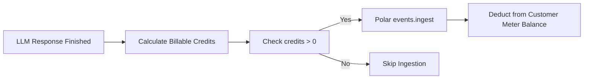

# AgentForge Billing & Credit System

AgentForge features an integrated usage-based billing engine powered by **Polar.sh**. This document explains the internal credit economics, model pricing tiers, meter ingestion pipelines, and balance verification rules.

---

## 1. Credit Economics & Peg

To protect users from confusing fractional fractions of cents, AgentForge standardizes on an internal **credit** currency:

$$\mathbf{1\ \text{Credit} = \$0.01\ \text{USD}\ (1\ \text{Cent})}$$

- **Granular & Intuitive**: Charges correspond directly to whole cents.
- **Minimum Charge**: Any successful model turn that generates tokens incurs a minimum cost of **1 credit**.
- **Ceiling Rounding**: Partial cent fractions are rounded up to the nearest whole credit:
  $$\text{Credits} = \max\left(1, \left\lceil \frac{\text{Estimated Cost (USD)}}{0.01} \right\rceil\right)$$

---

## 2. Model Pricing Tiers

Token pricing is tracked in `@agentforge/shared/src/models.ts` and measured per million ($10^6$) tokens:

| Model ID | Provider | Input Cost / 1M Tokens | Output Cost / 1M Tokens | Cost in Credits (Input / Output per 1K tokens) |
| :--- | :--- | :--- | :--- | :--- |
| **`claude-opus-4-6`** *(Default)* | Anthropic | $5.00 | $25.00 | 0.50¢ / 2.50¢ |
| **`claude-sonnet-4-6`** | Anthropic | $3.00 | $15.00 | 0.30¢ / 1.50¢ |
| **`claude-haiku-4-5`** | Anthropic | $1.00 | $5.00 | 0.10¢ / 0.50¢ |
| **`gpt-5.4`** | OpenAI | $2.50 | $15.00 | 0.25¢ / 1.50¢ |
| **`gpt-5.4-mini`** | OpenAI | $0.75 | $4.50 | 0.075¢ / 0.45¢ |
| **`gpt-5.4-nano`** | OpenAI | $0.20 | $1.25 | 0.02¢ / 0.125¢ |

---

## 3. Usage Metering Pipeline



### Credit Calculation Function (`calculateCreditsForUsage`)
Located in `packages/server/src/lib/credits.ts`:
```ts
export function calculateCreditsForUsage({
  provider,
  model,
  usage,
}: CalculateCreditsForUsageParams): BillableUsage {
  const tokenCounts = getTokenCounts(usage);
  const pricing = getModelPricing(provider, model);
  const estimatedCostUsd = estimateCostUsd(tokenCounts, pricing);
  const credits = convertUsdToCredits(estimatedCostUsd);

  return { credits };
}
```

### Ingestion to Polar (`ingestAiUsage`)
Located in `packages/server/src/lib/polar.ts`:
- Dispatches an idempotent event with `externalId: "chat-message:<messageId>"`.
- Target meter event: `"nightcode_usage"`.
- Metadata: `{ credits: number }`.

---

## 4. Balance Gating Middleware (`requireCreditsBalance`)

AgentForge protects API resources by ensuring users maintain an active credit balance before starting new requests:

1. Prior to creating a session (`POST /sessions`) or processing a message (`POST /chat`), the middleware contacts Polar:
   ```ts
   const customerState = await polar.customers.getStateExternal({
     externalId: userId,
   });
   ```
2. It locates the active meter matching `POLAR_CREDITS_METER_ID`.
3. If `creditsMeter.balance <= 0`:
   - The server immediately rejects the request with **`402 Payment Required`**.
   - Error payload:
     ```json
     {
       "error": "No credits remaining. Run /upgrade to buy more credits."
     }
     ```
   - In the CLI, this surfaces as an actionable error prompt letting the developer run `/upgrade`.

---

## 5. Purchasing & Managing Credits

### Upgrading via the CLI
1. Run `/upgrade` in the AgentForge prompt.
2. The CLI contacts `POST /billing/checkout`.
3. The server generates a pre-authenticated Polar checkout session associated with the user's `externalCustomerId`.
4. The user's default browser opens to complete payment.
5. Upon successful checkout, Polar automatically tops up the user's credit meter.

### Viewing Usage & Invoices
Run `/usage` in the CLI to open the **Polar Customer Portal**, where developers can inspect past transaction receipts, review meter consumption graphs, and update billing methods.
